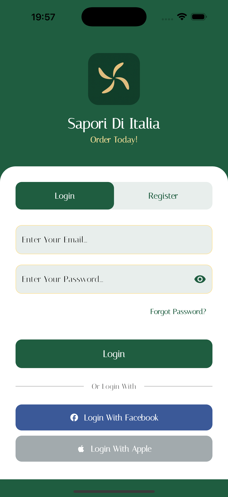
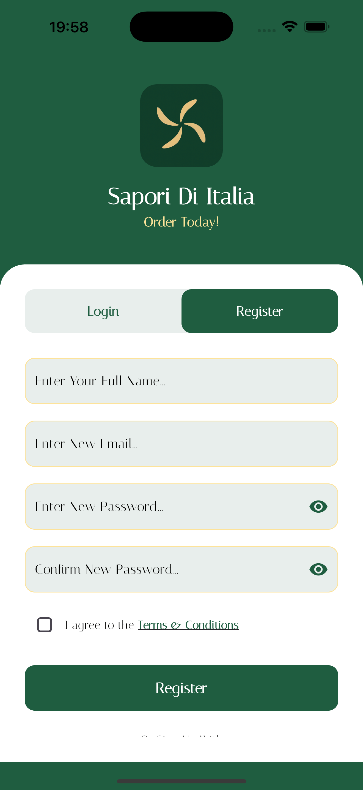
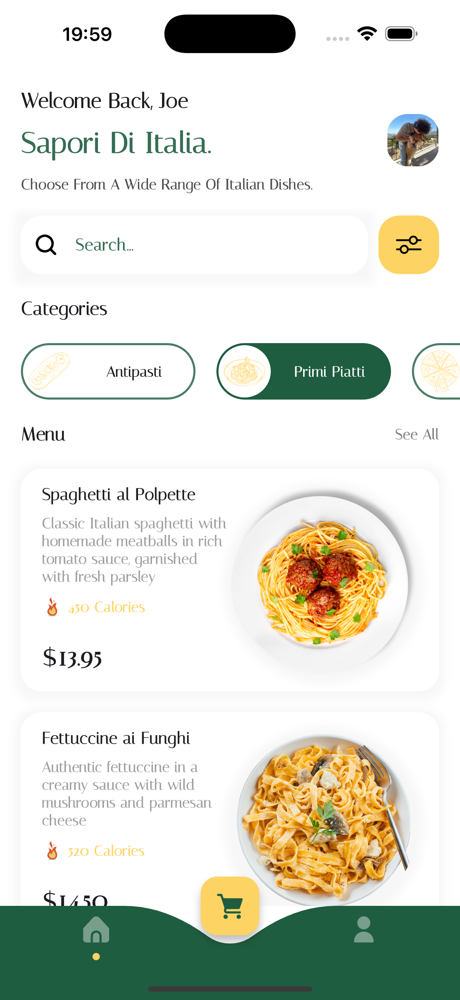
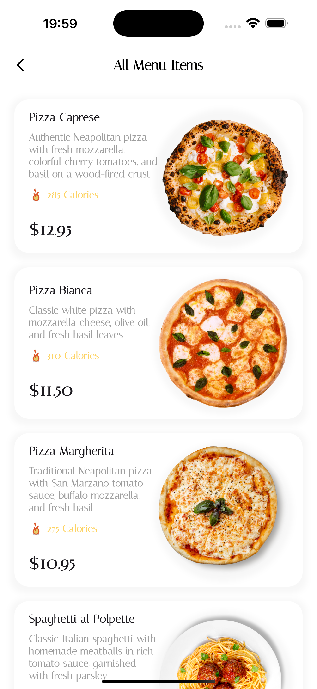
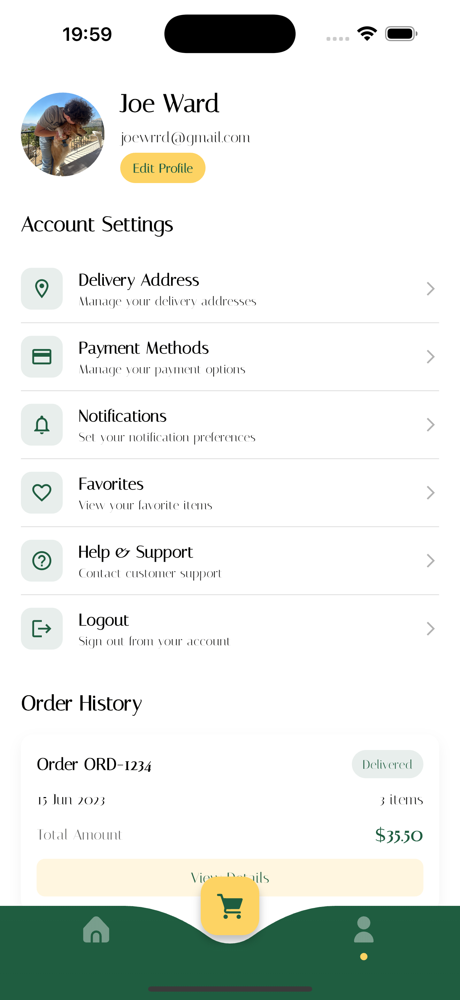
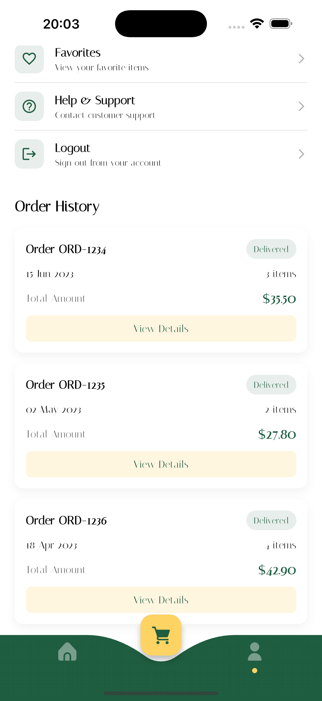
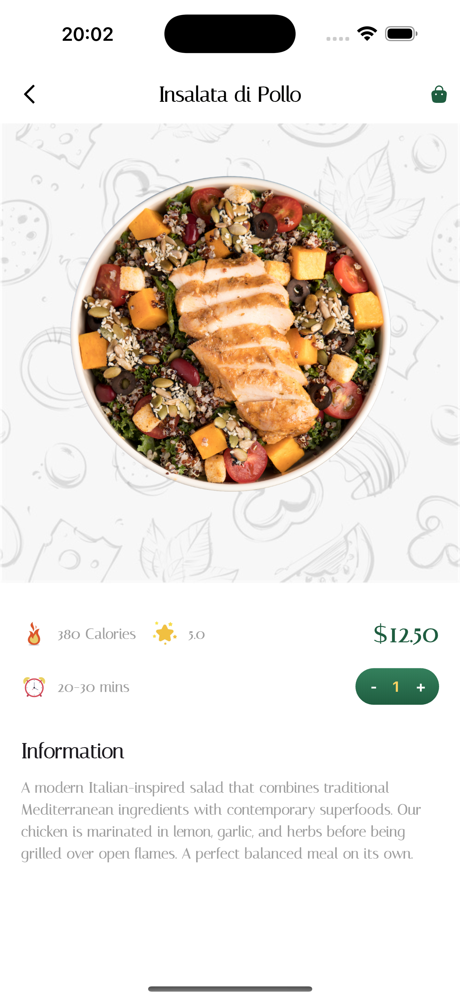
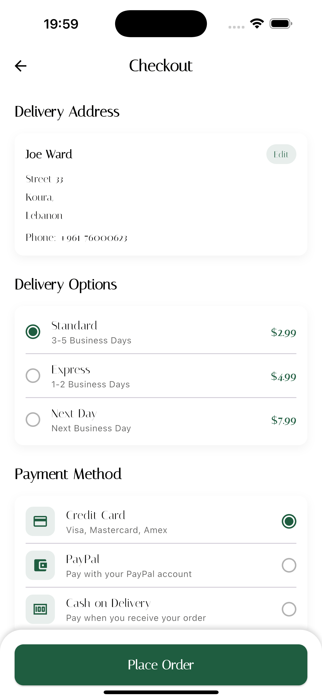
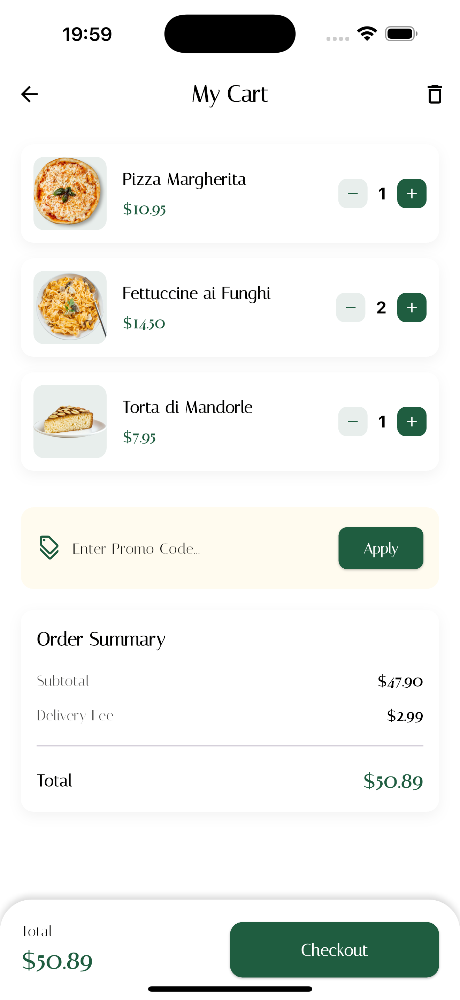
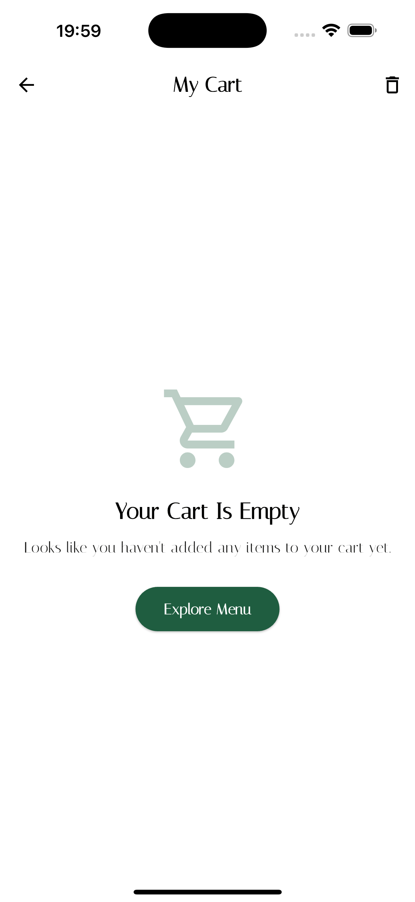

# Sapori Di Italia - Flutter Italian Food Ordering App

A beautifully designed Italian food ordering application built with Flutter, offering users a seamless experience to browse, order, and enjoy authentic Italian cuisine delivered right to their doorstep.

Created To Engage More Into GetX State Management (Using Stuff Im Unfamiliar With For Testing Purposes)

## Features

🍕 **Italian Food Ordering**

- Comprehensive menu of authentic Italian dishes
- Customizable orders with special instructions
- Cart management system
- Checkout and payment processing
- Order history and tracking

🔍 **Menu Discovery**

- Featured and popular dishes
- Category-based browsing (Pasta, Pizza, Appetizers, etc.)
- Special offers and promotions
- Search functionality with filters
- Detailed dish information and ingredients

👤 **User Management**

- Secure authentication system
- Profile customization
- Order history tracking
- Favorite dishes collection
- Delivery address management

🎨 **Modern UI/UX**

- Elegant Italian-inspired design
- Intuitive navigation
- Responsive layout
- Beautiful animations and transitions
- Dark and light theme support

## Technical Stack

### Frontend

- Flutter for cross-platform development
- GetX for state management
- Custom widgets for food ordering components
- Responsive UI with Google Fonts
- Image handling and caching

### Backend

- Firebase Authentication
- Cloud Firestore for data storage
- Real-time order tracking
- Secure payment processing
- Push notifications for order updates

## Getting Started

### Prerequisites

- Flutter (latest version)
- Firebase account
- Android Studio / VS Code
- Git

### Installation

1. Clone the repository

```bash
git clone https://github.com/yourusername/saporidiitalia.git
```

2. Install dependencies

```bash
cd saporidiitalia
flutter pub get
```

3. Configure Firebase

- Create a new Firebase project
- Add Android & iOS apps in Firebase console
- Download and add configuration files
- Enable Authentication methods
- Set up Cloud Firestore rules

4. Run the app

```bash
flutter run
```

## Project Structure

```
lib/
├── data/                # Data layer
│   └── product_data.dart # Product information
├── pages/               # App screens
│   ├── cart/            # Cart functionality
│   ├── checkout/        # Checkout process
│   ├── detail/          # Food item details
│   ├── home/            # Main screen
│   ├── login/           # Authentication
│   ├── profile/         # User profile
│   ├── root/            # Root navigation
│   └── see_all/         # Category listings
├── routes/              # Navigation
│   ├── app_route_name.dart # Route constants
│   └── app_route_page.dart # Route definitions
├── utils/               # Utility functions
│   └── color.dart       # Color definitions
├── widgets/             # Reusable components
└── main.dart            # Entry point
```

## Features in Detail

### Food Ordering System

- Browse comprehensive Italian menu
- View detailed dish information
- Customize orders with special instructions
- Add items to cart
- Order tracking and notifications

### Menu Discovery

- Featured and popular dishes
- Category-based browsing
- Search with filters
- Daily specials and promotions
- Detailed ingredient information

### User Features

- Email authentication
- Profile management
- Order history
- Favorite dishes
- Multiple delivery addresses

## Screenshots

<div align="center">
  <div style="display: flex; flex-direction: column; align-items: center;">
    <div style="flex: 2; padding: 10px;">
      <p><strong>Authentication Screens</strong></p>
      <div style="display: flex; gap: 10px;">
        
        
      </div>
    </div>
    <div style="display: flex; align-items: flex-start; margin-top: 20px;">
      <div style="flex: 2; padding: 10px;">
        <p><strong>Home & Menu Screens</strong></p>
        <div style="display: flex; gap: 10px;">
          
          
      </div>
    </div>
    <div style="display: flex; align-items: flex-start; margin-top: 20px;">
      <div style="flex: 2; padding: 10px;">
        <p><strong>Profile & Order History</strong></p>
        <div style="display: flex; gap: 10px;">
           
          
        </div>
      </div>
      <div style="flex: 2; padding: 10px;">
        <p><strong>Item Detail & Checkout</strong></p>
        
        
      </div>
      <div style="flex: 2; padding: 10px;">
        <p><strong>Cart Experience</strong></p>
        
        
      </div>
    </div>
  </div>
</div>

## Order Tracking

- Real-time order status updates
- Estimated delivery time
- Delivery tracking
- Order history and reordering

## Contributing

Contributions are welcome! Please feel free to submit a pull request.

1. Fork the repository
2. Create your feature branch (`git checkout -b feature/amazing-feature`)
3. Commit your changes (`git commit -m 'Add some amazing feature'`)
4. Push to the branch (`git push origin feature/amazing-feature`)
5. Open a Pull Request

## License

This project is licensed under the MIT License - see the LICENSE file for details.

## Acknowledgements

- [Flutter](https://flutter.dev/) for the amazing framework
- [Firebase](https://firebase.google.com/) for backend services
- [GetX](https://pub.dev/packages/get) for state management
- [Google Fonts](https://pub.dev/packages/google_fonts) for typography
- All contributors who have helped improve this project
